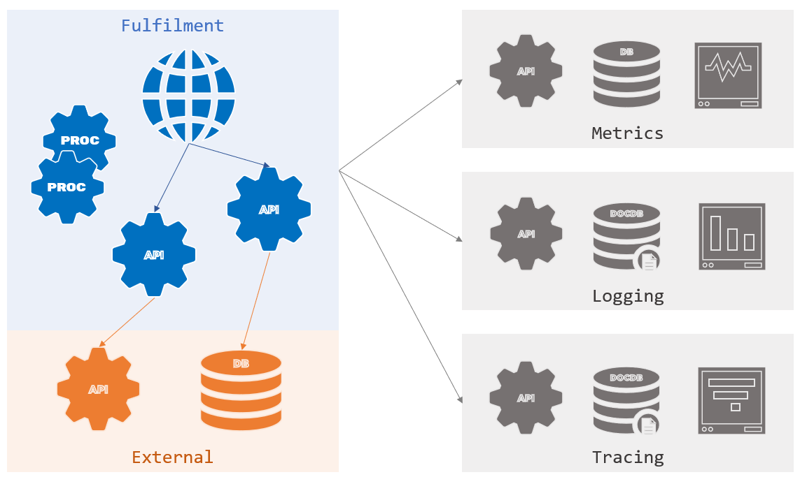

# Hackathon!

The hackathon is your chance to spend some decent time using observability tools to diagnose problems.

You'll use all the key skills you've learned in the course, and:

- 😣 you will get stuck
- 💥 you will make wrong turns
- 📑 you will need to research and troubleshoot

**That's why the hackathon is so useful!** 

It will help you understand which areas you're comfortable with and where you need to spend some more time.

And it will give you a experience of using instrumentation as a tool to solve issues. You'll see what types of instrumentation are useful, and how to visualize and search through different levels of data.

> ℹ There are three parts to the hackathon - you're not expected to complete them all. Just get as far as you can in the time, it's all great experience. **And you don't need to fix the problems**, just identify exactly what's wrong.

The demo app and the observability stacks are set up for you, and all the metrics you need are already being captured. Your job isn't to add instrumentation, it's to use the existing instrumentation to answer questions.

The app is the same document processing solution you've used, with multiple components plugging into multiple observability sub-systems:



## Setup

Start by clearing down any containers you have running from the labs:

```
docker rm -f $(docker ps -aq)
```

Now start all the observability stacks (the YAML files are all in the `hackathon` folder if you want to check them out, but you don't need to - it should all _just work_):

```
docker-compose -f hackathon/logging.yml -f hackathon/metrics.yml -f hackathon/tracing.yml up -d
```

**Before you start the app containers**, create an Elasticsearch index with custom mappings - this will make working with logs much easier:

```
PUT /hackathon
{
  "mappings": {
    "properties": {
      "LogLevel": {"type": "keyword"},
      "MachineName": {"type": "keyword"},
      "EventType": {"type": "keyword"},
      "RequestId": {"type": "keyword"},
      "Duration": {"type": "integer"},
      "SourceContext": {"type": "keyword"},
      "AppVersion": {"type": "keyword"},
      "AppName": {"type": "keyword"},
      "UserId": {"type": "keyword"}
    }
  }
}
```

<details>
  <summary>💡 Helpful hint</summary>

The logging stack includes Kibana, available at http://localhost:5601. If you wait for it to start, you can create the index by running that request in the Console.

</details><br/>

Run the application stack:

```
docker-compose  -f hackathon/apps.yml up -d
```

> The web application uses a different port now, you can access it at http://localhost:8080. Try listing and submitting documents to verify it's all working.


Run load generators so you get a constant stream of instrumentation from the app:

```
docker-compose  -f hackathon/load.yml up -d
```

You now have all the tools you're familiar with from the course to investigate issues, and plenty of data to work with:

- Prometheus at http://localhost:9090
- Grafana at http://localhost:3000 (login with `admin`, password `obsfun`)
- Jaeger at http://localhost:16686
- Kibana at http://localhost:5601

## Part 1 - diagnosing slow responses

One of the administration website users has reported slow response times when they try and list documents.

You can replicate this by loading documents from the home page with different user IDs:

- try user `0421` and the list loads quickly, usually within a second
- for user `0479` the load is much slower - at least 25 seconds - every time you run it.

What's going on here, and which product team do we need to get involved to make the fix?

<details>
  <summary>💡 Helpful hints</summary>

This is a duration issue, so the first step is to work out which component is running slowly. Once you've found it you'll need to drill down to another level to find out exactly what's happening.

</details><br/>

<details>
  <summary>🎯 One solution</summary>

If you don't get this finished, you can check out the [sample solution for part 1](./solution/part-1.md).

</details><br/>

## Part 2 - capacity planning

We're running two instances of the fulfilment processor back-end. We want to know if that's enough, or do we need to commission more hardware to run extra processors?

<details>
  <summary>💡 Helpful hints</summary>

This is about saturation - we want to know how much compute power the instances are using to see if they're near capacity. But we also need to be sure the instances are working correctly at the current processing levels.

</details><br/>

<details>
  <summary>🎯 One solution</summary>

If you don't get this finished, you can check out the [sample solution for part 2](./solution/part-2.md).

</details><br/>

## Part 3 - prioritising development work

This version of the app does some pre-rendering when users submit documents for processing. The logic there is quite complex and we know we can optimize the code to reduce rendering times. 

We have a finite engineering budget, so we need to know which type of document will benefit most from optimization - PDF, Word etc.

<details>
  <summary>💡 Helpful hints</summary>

We need to understand processing duration for this - and remember all the metrics we need are already being captured. 

The goal is to understand the average processing time for each document type. That will tell us which area would benefit most from optimization - but we also want to make sure we only optimize something that gets a lot of use.

</details><br/>

<details>
  <summary>🎯 One solution</summary>

If you don't get this finished, you can check out the [sample solution for part 3](./solution/part-3.md).

</details><br/>


## Over to you...

There are plenty more metrics being collected, so if you have time you can build out some full dashboards to give additional insight into the application health, visualizing the things you think are important.

___ 

## Cleanup

When you're done you can remove all the containers:

```
docker rm -f $(docker ps -aq)
```

If you've been running the load generators for a long time, you'll have some pretty big log files in the `hackathon/data` directory, so you might want to clear that out:

```
# on Windows:
rm -fo hackathon/data/*

# on macOS or Linux:
rm '-f hackathon/data/*'
```