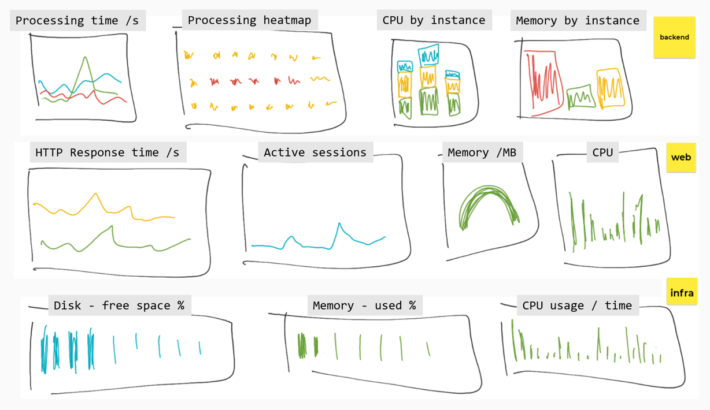
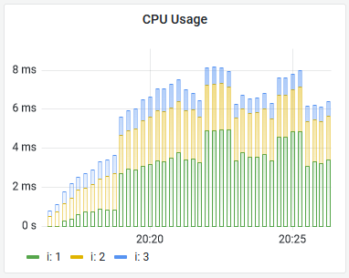
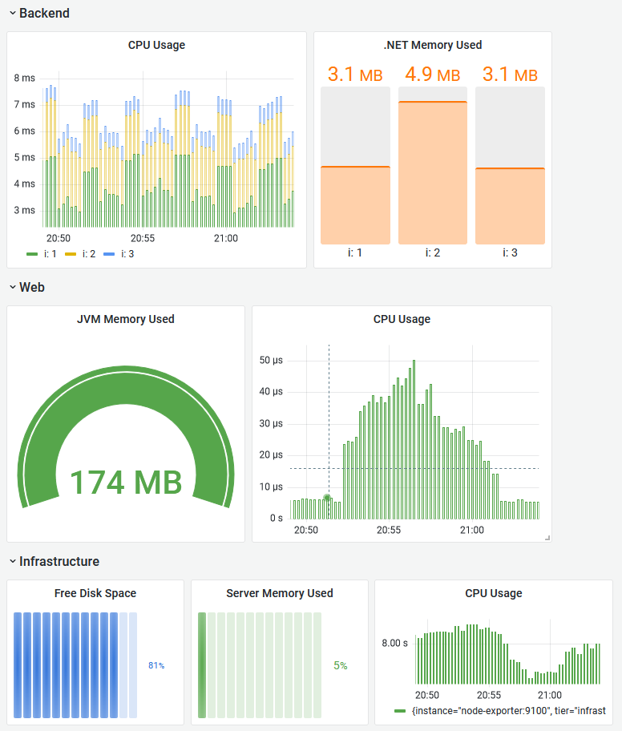
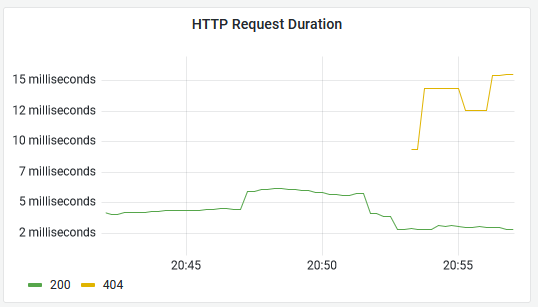
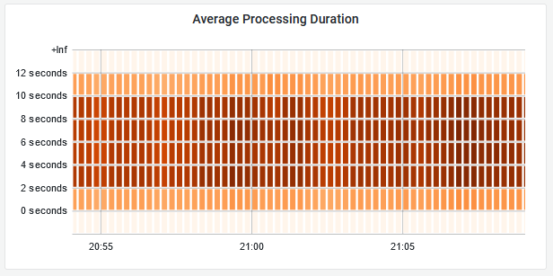

# Building Grafana Dashboards

It's easy to go overboard with visualizations and build fancy panels for every metric you capture. There will be too much information if you have more than a dozen or so panels on your dashboard, and it will stop being effective. 

You should build your dashboards starting from a wireframe where you sketch out panels which answer the questions you have about the status of your app.

## Reference
 
- [Best practices for creating dashboards](https://grafana.com/docs/grafana/latest/best-practices/best-practices-for-creating-dashboards/)
- [Sample dashboards](https://grafana.com/grafana/dashboards) - official and community-built examples
- [Grafana configuration](https://grafana.com/docs/grafana/latest/administration/configuration/)
- [Automatic provisioning for Grafana](https://grafana.com/docs/grafana/latest/administration/provisioning/)

## Run Prometheus & Grafana

We'll run the metrics components in Docker containers again, but this time we'll make use of Grafana's automation so we don't need to configure a data source manually:

- [metrics.yml](./metrics.yml) - Prometheus and Grafana, with custom configuration files
- [datasource-prometheus.yml](./config/grafana/datasource-prometheus.yml) - provisioning to set up the Prometheus data source
- [custom.ini](./config/grafana/custom.ini) - custom configuration settings

Run the metrics containers:

```
docker-compose -f labs/grafana-dashboard/metrics.yml up -d
```

> Browse to Grafana at http://localhost:3000

Sign in with the configured credentials:

- username: `admin`
- password: `obsfun`

We're using the light theme by default now; browse to http://localhost:3000/datasources and you'll see Prometheus is already configured.

Prometheus is running too, using a new configuration:

- [prometheus.yml](./config/prometheus.yml) - we have the `tier` label, and a new label for the document processor - `instance_number`; that will have 1, 2 or 3 which is easier to work with than the full instance label.

> Browse to http://localhost:9090/service-discovery

Click _show more_ for the fulfilment processor job, and you'll see the new target labels which will be applied to all metrics.

Run all the demo apps and the metrics will start being collected ([apps.yml](./apps.yml) specifies all the containers):

```
docker-compose -f labs/grafana-dashboard/apps.yml up -d
```

## Visualzing counters and gauges

We're going to build a dashboard for the demo app, focusing on some of the [SRE Golden Signals](https://sre.google/sre-book/monitoring-distributed-systems/). Here's the sketch showing what we're looking for:



Different visualizations work well for different types of data. In these exercises you'll be given the PromQL and some guidance, but you don't need to represent panels exactly as they are here.

All our components record CPU and memory usage so we can build panels to show saturation.

### Fulfilment processor saturation

This one is nice and simple. For the memory visualization, we can use the `dotnet_total_memory_bytes` metric - it's only produced by this component.

A _bar gauge_ would be a good representation, showing one bar per instance. This is a lightweight component, under 3MB of memory is good, up to 5MB is OK - above that isn't so good. It would look something like this:


<details>
  <summary>Need some help?</summary>

Configure your bar gauge to use:

- units: bytes (SI)
- thresholds: orange 3MB, red 5MB 
- legend: {{instance_number}}

</details><br/>

This component produces a `process_cpu_seconds_total` metric to show CPU usage - but other components use the same metric name. To build a panel for this you'll need to filter by label:

```
sum without(instance, job) (rate(process_cpu_seconds_total{job="fulfilment-processor"}[5m]))
```

A _time series_ visualization would work well, using bars to show the stacked results, something like this:



### Document API and node saturation

These are more counters and gauges to visualize. 

Rather than do more of the same, you can import the dashboard from `dashboards/part-1.json` to load the rest of the saturation panels:



> Load this dashboard and edit the panels to see how they're put together

<details>
  <summary>Or if you'd rather build it yourself...</summary> 

For the Java app you'll use this memory query:

```
sum without(instance, job, tier, id, area) (jvm_memory_used_bytes{job="fulfilment-api"})
```

- a gauge would work well
- units: bytes (SI)
- thresholds: orange 190MB, red 250MB 

And this CPU query:

```
sum without(job) (rate(process_cpu_usage{job="fulfilment-api"}[5m]))
```

For the node memory, it would be useful to see how much memory is in use as a percentage, rather than the number of megabytes. 

The node exporter has multiple memory metrics you can combine to show that:

```
(node_memory_MemTotal_bytes - node_memory_MemFree_bytes - node_memory_Buffers_bytes - node_memory_Cached_bytes - node_memory_SReclaimable_bytes) / node_memory_MemTotal_bytes 
```

- a horizontal bar gauge would suit this
- units: percentage
- min 0, max 1.0

You can use a similar visualization to show percentage of free disk space:

```
min without(mountpoint) (node_filesystem_avail_bytes) / min without(mountpoint) (node_filesystem_size_bytes)
```

And for the CPU panel:

```
sum without(job, cpu, mode) (rate(node_cpu_seconds_total[5m]))
``` 

</details><br/>

## Visualzing summaries and histograms

Latency is the next important signal - we can add visualizations to show average HTTP request times for the document API, and percentile document processing times.

> You can load the completed visualizations for this section from `dashboards/part-2.json`, or continue to build them yourself

The Java API records a summary metric called `http_server_requests` which includes a response code label, so we can graph durations for OK and non-OK responses.

Add a new panel and use this PromQL to get the average durations:

```
sum by(status) (rate(http_server_requests_seconds_sum{job="fulfilment-api"}[5m])) /  sum by(status) (rate(http_server_requests_seconds_count{job="fulfilment-api"}[5m])) 
```
- a _time series_ visualization is fine here
- unit: duration (s)
- legend: {{status}}

Your panel will look something like this - browse to http://localhost:8080/documents and http://localhost:8080/notfound to produce data with different response codes:



> Summaries only give you a coarse average, compared to histograms. You store less data but you can't break down the average to see outliers. 

The fulfilment processor records a histogram of processing times. You can use Promtheus' `histogram_quantile` function to generate percentiles. This PromQL will give the 90th percentile processing time, split by instance:

```
histogram_quantile(0.90, sum without(instance, job, tier)(rate(fulfilment_processing_seconds_bucket[5m])))
```

We can use that to show the 90th percentile processing time, i.e. the processing duration for 90% of documents (with the remaining 10% taking longer):


There's nothing special about the response from a histogram query, you can build it into a panel in the usual way with a _time series_ visualization.

## Lab

Grafana does have special handling for histograms - you can visualize them as _heatmaps_ which clearly show the distribution of data over time.

To finish the dashbord, put together a heatmap for the fulfilment processing time histogram using this query:

```
avg by(le) (rate(fulfilment_processing_seconds_bucket[5m]))
```

Your panel will look something like this:



> Stuck? Try [hints](hints.md) or check the [solution](solution.md).

___
## Cleanup

Cleanup by removing all containers:

```
docker rm -f $(docker ps -aq)
```
