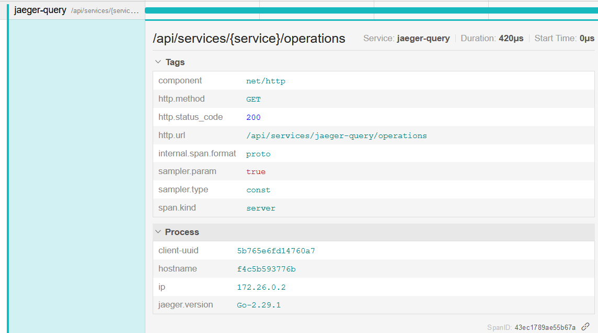

# Running Jaeger

[Jaeger]() is a distributed tracing system - it collects and stores traces, and gives you a web UI to find and visualize traces.

You can run Jaeger in a production configuration with different features running in different processes, swapping out the data store or adding a message queue to buffer collection. 

## Reference

- 

## Run Jaeger

We'll run a simple configuration of Jaeger, where all the components run in a single Docker container:

- [jaeger.yml](./jaeger.yml) - specifies a Jaeger container, connected to a tracing network and publishing port 16686, the default web UI port

Run Jaeger:

```
docker-compose -f labs/jaeger/jaeger.yml up -d
```

Browse to the Jaeger UI at http://localhost:16686; hit the _Search_ menu at the top and refresh your browser page.

You'll see the _Service_ dropdown has a new entry - click it, select the service `jaeger-query` and hit the _Find Traces_ button.

Click on the first trace in the list and expand the details, it will look something like this:



📋 What generated this trace, and what information does it give you?

<details>
  <summary>Need some help?</summary>

Jaeger records traces itself - we're seeing the call to the API from the web UI to list the operations that have been stored.

There's a single span in the trace, so the API responds without making any further HTTP calls.

The span records tags which are very similar to the ones we've seen from the [tracing lab](../tracing/README.md) exercises, things like:

- http.method: GET
- http.status_code: 200
- span.kind: server

</details><br/>

Tags are a collection of key-value pairs which you can set in your spans to record additional information. There are some common tags which you'll see across components, but the collection is arbitrary and you can add whatever data is useful in your spans.

The trace timeline is the most useful view in Jaeger, but you can also switch to other views of the same data. In the dropdown at the top-right of the screen, switch from _Trace Timeline_ to:

- _Trace Statistics_ - to see low-level timing details about the spans
- _Trace JSON_ - to see the full log data

All the views are more useful when you have traces recording multiple spans across different components.

## Exporting traces to Jaeger

> TO HERE

- apps.yml - api, web + auth service, all in app network + tracing network

docker-compose -f labs/jaeger/apps.yml up -d

http://localhost:8070

Jaeger search

- Fulfilment.Web, single trace - http GET for /

Hit Go in web UI


Jaeger search - services for all components, find for Fulfilment.Web


- what is the call trace?

- web to authz; authz to external; web to api
- what's taking the most time?

Fulfilment.Autz service calls https://blog.sixeyed.com; takes about 0.5 sec


## Lab

submit a doc - what is the call stack?

which method on which class actually create the document?