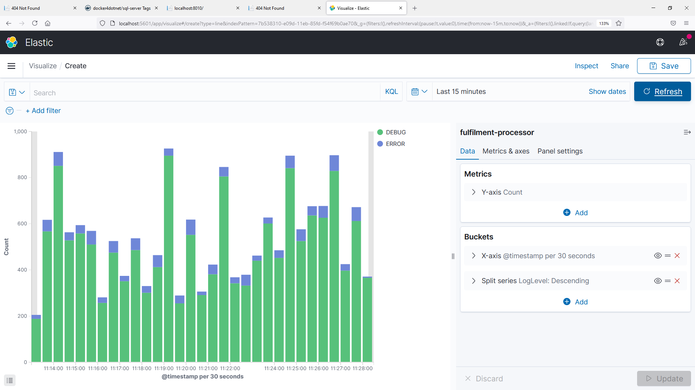
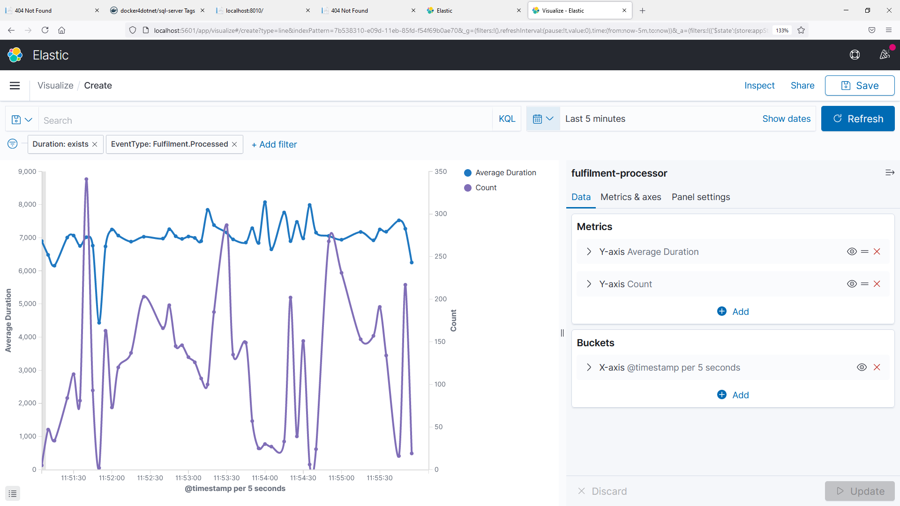

# Kibana Dashboards

## Reference

- [saved queries]
- [visualizations]
- [dashboards]

## Setup

Run ELK:

```
docker-compose -f labs/kibana-dashboard/logging.yml up -d
```

> Open http://localhost:5601, wait for ready


Create mappings:

PUT /fulfilment-processor
{
  "mappings": {
    "properties": {
      "LogLevel": {"type": "keyword"},
      "MachineName": {"type": "keyword"},
      "EventType": {"type": "keyword"},
      "RequestId": {"type": "integer"},
      "Duration": {"type": "integer"},
      "SourceContext": {"type": "keyword"},
      "AppVersion": {"type": "keyword"}
    }
  }
}

PUT /web-logs
{
  "mappings": {
    "properties": {
      "bytes": { "type": "integer" },
      "response": { "type": "short" },
      "httpversion": { "type": "float" },      
      "clientip": { "type": "ip" },      
      "referrer": { "type": "text" },      
      "agent": { "type": "text" }
    }
  }
}

Run apps:

```
docker-compose -f labs/kibana-dashboard/apps.yml up -d
```

Kibana:

check indices are created & populated

GET _cat/indices

- add index pattern for apache logs 

`web-logs`

- add index pattern for fulfilment logs 

`fulfilment-processor`

# Visualizations

Buckets - grouping data, e.g by log level
Metrics - aggregation over the buckets, e.g. count

Menu: _Visualize...Create_

- Area
- Select fulfilment-processor index pattern
- Add bucket - x-axis; date histogram, timestamp field - split count by time range; _Update_
- Count of all logs

- Add sub-bucket- split series
- terms, loglevel

-_metrics & axes_
- change to stacked bar

 

- save, give it a sensible name

> create another visualization:

- line
- average duration - one line
- count of processed docs - second line
- only some event types record duration, so filter
- split by time
- customize axes so each line has its own y-axis

 

- save

## Dashboard

- create
- add existing - select loglevel chart
- add existing - select duration chart
- save

- can filter/search and select timespan, charts update


## Saved queries

## Lab
