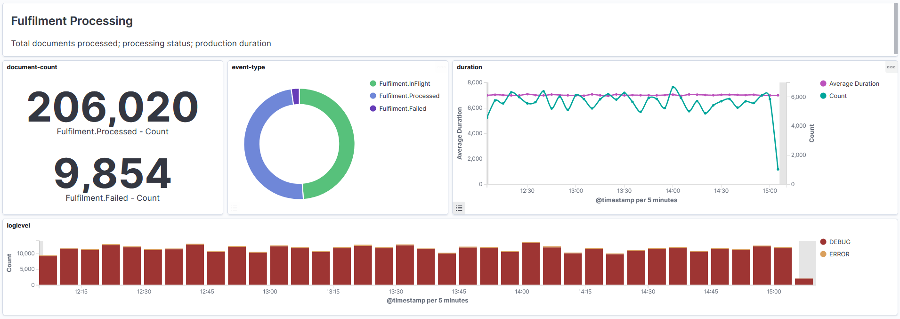

# Lab Solution

## Export the dashboard

From the main menu select _Stack Management...Saved Objects_. 

You'll see a list of objects - filter the type to _Dashboards_ and you'll see your dashboard in the list.

Check the tickbox next to the dashboard and click _Export 1 object_ - in the next window make sure _Include related objects_ is checked.

Your dashboard gets downloaded as an `.ndjson` file, which is new-line delimited JSON

> My dashboard for the lab is in [lab/dashboard.ndjson](./lab/dashboard.ndjson)


## Reset Kibana data

Kibana's data store is just an index - so you can delete it to reset state.

In the Console, first check the index name:

```
GET _cat/indices?v
```

> You index name will start with `.kibana` - e.g. `.kibana_1`.

Delete the index using the Console - this just removes the Kibana data (for index patterns, dashboards etc.), not the underlying data for the logs.

```
DELETE /.kibana_1
```

> This is a useful way to reset Kibana in a dev environment as you're working on visualizations, but use it carefully. You don't get any confirmation asking you if you're sure!

## Import the dashboard

Kibana keeps working even though you've wiped its data store, but all is not well and you'll get errors as you try different features. 

Restarting the container will initialize the data store again and fix everything up:

```
docker restart obsfun_kibana_1
```

Now refresh the UI and browse to _Saved Objects_. Click _Import_ and you can load your (or my) dashboard file - that includes all the related objects, including the index pattern.

Navigate to the dashboard to confirm it's all working well - the only difference you might see is the colour scheme:



> I left the demo app running for a few hours and set a long timeline for this screenshot.