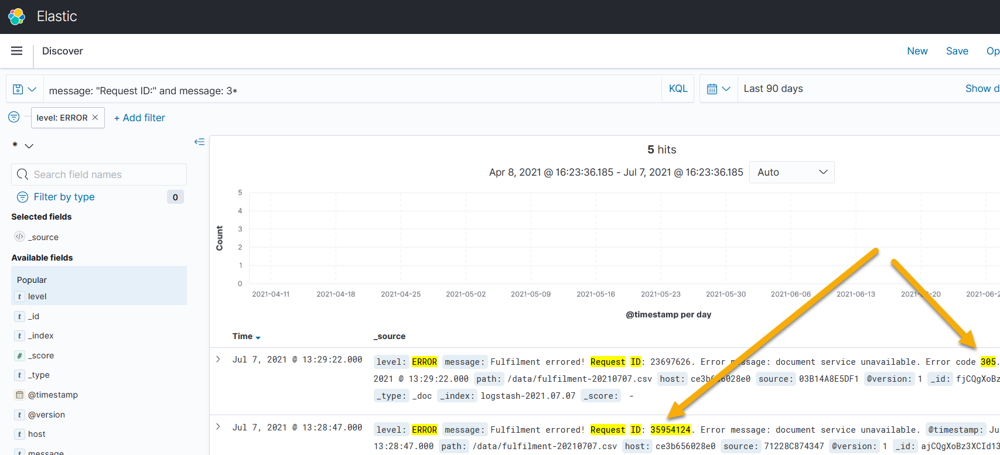

# Lab Solution

## Load the data

_If you're using Windows, run this script to set up a Linux-style copy command:_

```
# ON Windows - enable scripts:
Set-ExecutionPolicy -ExecutionPolicy Unrestricted -Scope Process

# then run:
. ./scripts/windows-tools.ps1

```
Copy the data file into the mounted data folder:

```
cp -f data/fulfilment-20210707.csv labs/kibana/data/
```

In the Kibana console, list indices:

```
GET _cat/indices?v
```

> When the log load has completed you'll see an index called `logstash-2021.07.07` with 86 documents.


Create an index pattern - you can use the exact index name, or a wildcard like `logstash-*`; use `@timestamp` as the primary time field.

## Query the index pattern

Switch to the _Discover_ tab and select your new index pattern. The search and filters from your last query are still there - remove them, ensure the timeframe is expanded to include 2021-07 and click _Update_.

Click on the `level` field from the list and you'll see the top results for that field. Click `+` on ERROR to add that value as a filter.

Now you'll have 8 hits but you can't filter any more as there isn't a numeric field containing the request ID. The best you can do is search where the message field contains the phrase "Request ID", and a wildcard beginning with "3":

```
message: "Request ID:" and message: 3*
```

> You'l see 5 hits, but only 4 are what we want:



The wildcard search finds the additional record with error code starting with 3. This data doesn't have enough structure for precise searches.